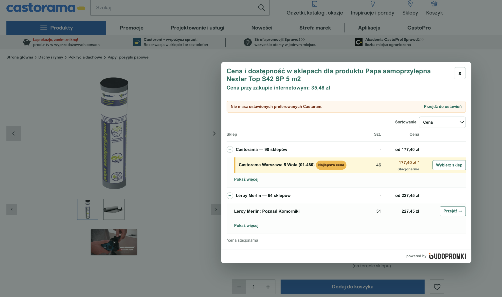
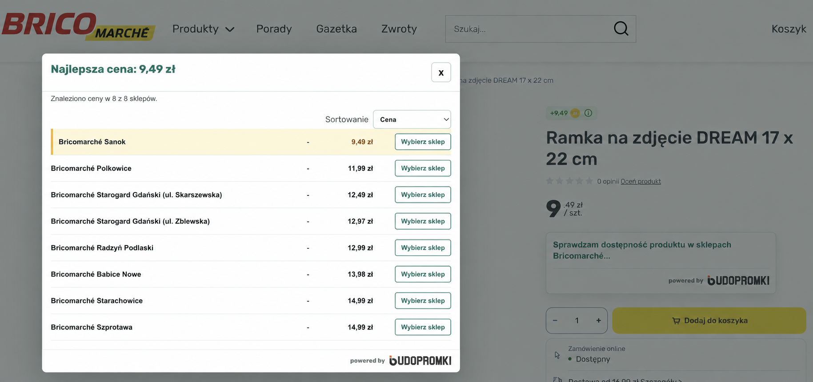
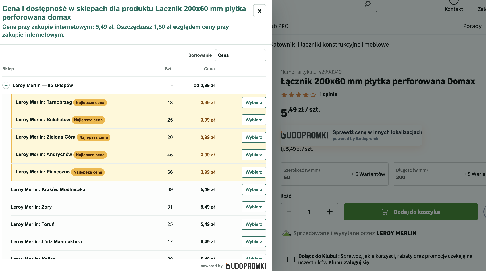
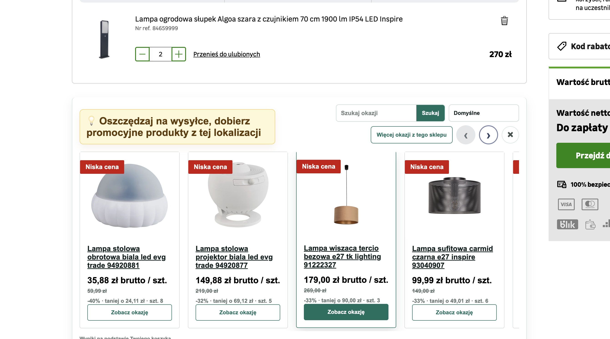

# Budopromki — porównuj ceny materiałów budowlanych

  <strong>Sprawdź cenę, dostępność i odbiór produktu, zanim pojedziesz do sklepu.</strong> 
  Budopromki porównuje oferty Leroy Merlin, Castoramy i Bricomarché bez otwierania wielu kart.

  <a href="https://chromewebstore.google.com/detail/budopromki-najlepsze-prom/fonoglmhjbfhkiepacfebgmnkojdipl"><strong>Zainstaluj w Chrome</strong></a>
  ·
  <a href="https://addons.mozilla.org/pl/firefox/addon/budopromki-promocje-budowlane/"><strong>Zainstaluj w Firefoxie</strong></a>
  ·
  <a href="https://budopromki.pl/wtyczka">Dowiedz się więcej</a>

Budopromki to rozszerzenie przeglądarki dla osób kupujących materiały budowlane. Pomaga znaleźć tę samą ofertę w innych sklepach, sprawdzić lokalną dostępność i wybrać korzystniejszy zakup.

## Co sprawdzisz z Budopromki?

- porównanie cen tego samego produktu w Leroy Merlin, Castoramie i Bricomarché;
- najniższą znalezioną cenę produktu;
- dostępność w konkretnym sklepie Castorama oraz liczbę widocznych sztuk;
- różne ceny tego samego produktu w poszczególnych Bricomarché;
- podpowiedzi dla produktów w koszyku Leroy Merlin;
- przejście bezpośrednio do wybranej oferty.

## Dostępność i liczba sztuk w Castoramie

Cena to nie wszystko, gdy produkt trzeba odebrać dziś. Budopromki pokazuje wyniki dla konkretnych sklepów Castorama w prostych kolumnach: **Sklep**, **Szt.** i **Cena**. Dzięki temu widać, gdzie produkt jest dostępny i ile sztuk pokazuje sklep.

Stan magazynowy i cena mogą zmieniać się w ciągu dnia — przed wyjazdem zawsze potwierdź je na stronie sklepu.

## Które Bricomarché ma najtaniej?

Poszczególne sklepy Bricomarché mogą oferować ten sam produkt w różnych cenach. Budopromki porównuje lokalizacje osobno i oznacza **„Najlepszą cenę”** wśród widocznych wyników. Możesz wybrać najtańszy sklep albo ten, który jest najbliżej.

## Porównanie ofert Leroy Merlin

Na stronie produktu Budopromki zestawia znalezione oferty, lokalizacje, ceny i — gdy sklep udostępnia dane — liczbę sztuk. Wystarczy otworzyć produkt i wybrać porównanie.

Przy koszyku Leroy Merlin rozszerzenie może także pokazać produkty promocyjne dostępne w wybranej lokalizacji.

## Jak korzystać?

1. Zainstaluj rozszerzenie w Chrome lub Firefoxie.
2. Otwórz stronę produktu w obsługiwanym sklepie.
3. Uruchom porównanie, aby zobaczyć ceny i lokalizacje.
4. Przed zakupem porównaj wariant, cenę, dostawę oraz odbiór osobisty.

## Zainstaluj za darmo

### Google Chrome

**[➡️ Zainstaluj Budopromki w Chrome Web Store](https://chromewebstore.google.com/detail/budopromki-najlepsze-prom/fonoglmhjbfhkiepacfebgmnkojdipl)**

### Mozilla Firefox

**[➡️ Zainstaluj Budopromki w Firefox Add-ons](https://addons.mozilla.org/pl/firefox/addon/budopromki-promocje-budowlane/)**

## Najczęstsze pytania

### Czy najniższa cena zawsze oznacza najtańszy zakup?

Nie zawsze. Sprawdź też wariant produktu, koszt dostawy, odbiór osobisty oraz dostępność w wybranej lokalizacji.

### Dlaczego ten sam produkt ma różne ceny w Bricomarché?

Sklepy mogą prowadzić własne promocje i politykę cenową. Dlatego porównanie pokazuje ceny według konkretnych lokalizacji.

### Czy liczba sztuk w Castoramie jest gwarantowana?

Nie. Dane magazynowe są dynamiczne; traktuj je jako wskazówkę i potwierdź dostępność bezpośrednio przed zakupem lub wyjazdem do sklepu.

## Linki

- [Budopromki.pl](https://budopromki.pl)
- [Strona wtyczki](https://budopromki.pl/wtyczka)
- [Chrome Web Store](https://chromewebstore.google.com/detail/budopromki-najlepsze-prom/fonoglmhjbfhkiepacfebgmnkojdipl)
- [Firefox Add-ons](https://addons.mozilla.org/pl/firefox/addon/budopromki-promocje-budowlane/)
- [Polityka prywatności](https://budopromki.pl/polityka-prywatnosci)

---

**Budopromki — znajdź lepszą cenę, zanim kupisz.**
